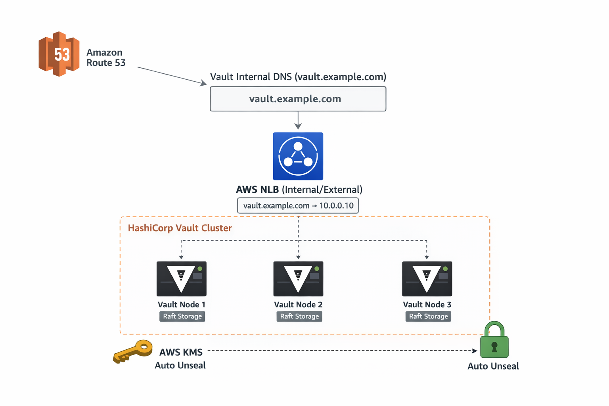

<h2> HashiCorp Vault High Availability and Auto-Unseal with AWS IAM, KMS and SSL </h2>

- [Vault Installation Guide (SSL Enabled)](#vault-installation-guide-ssl-enabled)
  - [🚀 Overview](#-overview)
  - [📋 Prerequisites](#-prerequisites)
    - [💻 EC2 Instances](#-ec2-instances)
    - [🖥️ System Requirements](#️-system-requirements)
    - [🛠️ Required Tools](#️-required-tools)
  - [🛠️ Steps](#️-steps)
    - [1. Create KMS Key For Vault Unsealing Process](#1-create-kms-key-for-vault-unsealing-process)
    - [2. Create IAM Policy \& Role To Use This KMS Key](#2-create-iam-policy--role-to-use-this-kms-key)
    - [3. Create a IAM Role  Attach `vault-iam-role` Policy](#3-create-a-iam-role--attach-vault-iam-role-policy)
    - [4. Create And attached `vault-iam-role` EC2 Instances](#4-create-and-attached-vault-iam-role-ec2-instances)
    - [5. Create And Network Load Balancer](#5-create-and-network-load-balancer)
    - [6. Create Route 53 Hosted Zone](#6-create-route-53-hosted-zone)
    - [7. Prepare EC2 Instances \& Install Vault (On Each node)](#7-prepare-ec2-instances--install-vault-on-each-node)
    - [Verify Hostname Resolution Across Nodes](#verify-hostname-resolution-across-nodes)
  - [Install Vault On Each node](#install-vault-on-each-node)
    - [🗄️ Prepare Raft Storage Directory](#️-prepare-raft-storage-directory)
    - [🔐 Generate Self-Signed SSL Certificate (Vault 1 Node Only)](#-generate-self-signed-ssl-certificate-vault-1-node-only)
    - [Zip The Certs \& Send Them To Other Nodes](#zip-the-certs--send-them-to-other-nodes)
    - [Move Cert Files To Appropriate Directory On Each node](#move-cert-files-to-appropriate-directory-on-each-node)
      - [⚙️ Configure Vault on Each Instance](#️-configure-vault-on-each-instance)
      - [Enable and start vault On Each node](#enable-and-start-vault-on-each-node)
      - [Initialize the Cluster (Vault 1 node)](#initialize-the-cluster-vault-1-node)
  - [🛠️ Troubleshooting](#️-troubleshooting)
    - [If vault2 and vault3 members do not join the raft](#if-vault2-and-vault3-members-do-not-join-the-raft)
    - [If needed we can also restart \& check logs](#if-needed-we-can-also-restart--check-logs)
  - [🗳️ Raft Quorum \& Leader Checks](#️-raft-quorum--leader-checks)
  - [🔨 Resetting a Vault Node’s Raft Storage (Destructive Action)](#-resetting-a-vault-nodes-raft-storage-destructive-action)
  - [**Vault Audit Logging Setup Guide**](#vault-audit-logging-setup-guide)
    - [**1. Create Log Directory**](#1-create-log-directory)


# Vault Installation Guide (SSL Enabled)



## 🚀 Overview
This guide helps you deploy a **production-ready, highly available HashiCorp Vault cluster** on AWS using **3 EC2 instances**, with built-in **AWS KMS auto-unseal**, **Raft storage**, and **self-signed SSL encryption** for secure communication.

**Your Vault deployment will provide:**
-   🔄 **High Availability (HA):** Automatic leader election across multiple nodes for uninterrupted service
-   🔑 **Secure Key Management:** AWS KMS handles sealing and unsealing of Vault keys automatically.
-   🌐 **External Access:** Single, consistent endpoint through an **AWS Network Load Balancer (NLB)**.
-   🔐 **Encrypted Communication:** All traffic between Vault nodes and clients is secured with TLS.
    


----------

## 📋 Prerequisites

Before deploying your Vault cluster, ensure your environment meets the following requirements:

### 💻 EC2 Instances

You will need **3 EC2 instances** for a highly available setup:
-   `vault-1`
-   `vault-2`
-   `vault-3`
    
### 🖥️ System Requirements
-   **Memory:** Minimum **1 GB RAM** free per instance
-   **Ports:** `8200` (Vault API) and `8201` (Raft communication) must be open
-   **AMI:** Ubuntu Server **24.04 LTS (HVM)**
### 🛠️ Required Tools

| Tool          | Purpose                                                                |
| ------------- | ---------------------------------------------------------------------- |
| `wget`        | Download Vault packages and other files from the internet              |
| `gpg`         | Verify package signatures and repository keys                          |
| `lsb-release` | Detect your OS version for proper repository configuration             |
| `unzip`       | Extract zipped Vault binaries                                          |
| `curl`        | Test API endpoints and download additional resources                   |
| `zip`         | Create zipped archives if needed for backups or configuration packages |
| `openssl`     | To generate self-signed SSL/TLS certificates


## 🛠️ Steps
### 1. Create KMS Key For Vault Unsealing Process
- Key Type: Symmetric
- Key Usage: Encrypt and Decrypt
- Purpose: Vault auto-unsealing master key
- Region: Same region as Vault servers
- Rotation: Enabled (recommended)
  
 ### 2. Create IAM Policy & Role To Use This KMS Key

- Policy should be 
```
{
    "Version": "2012-10-17",
    "Statement": [
        {
            "Sid": "VaultKMSUnseal",
            "Effect": "Allow",
            "Action": [
                "kms:Encrypt",
                "kms:Decrypt",
                "kms:DescribeKey"
            ],
            "Resource": "<KMS_KEY_ARN>"
        }
    ]
}
```
### 3. Create a IAM Role  Attach `vault-iam-role` Policy
- vault-policy policy
- add EC2 Adminstrative policy to the role

### 4. Create And attached `vault-iam-role` EC2 Instances
Deploy **3 EC2 instances** for your Vault cluster:
| Node    | Private IP    |
| ------- | ------------- |
| Vault-1 | 172.31.7.142  |
| Vault-2 | 172.31.10.220 |
| Vault-3 | 172.31.12.216 |
- 💡 Tip: Ensure all instances are in the same VPC and subnet for smooth internal communication.
Configure security groups to allow Vault traffic:
    - Port 8200: Vault API
    - Port 8201: Raft cluster communication
- Assign **IAM roles** with KMS permissions to **all instances** for auto-unseal.

### 5. Create And Network Load Balancer
Set up an **NLB** to provide a single endpoint for your Vault cluster:

-  **Create a Target Group**
    -   **Target Type:** Instances
    -   **Protocol:** TCP
    -   **Port:** 8200 (Vault API)
    -   **Health Check:**
        -   **Protocol:** HTTPS
        -   **Path:** `/v1/sys/health`
-  **Create a Network Load Balancer**
    - Listeners
        - Protocol: TCP
        - Port: 8200

### 6. Create Route 53 Hosted Zone
- Type: Private hosted zone
- Add A Domain Name `cloudnativebd.intra`

- **Create Records**

| Hostname           | Type | Routing Policy | Alias | Value / IP Address                                                                   |
| ------------------ | ---- | -------------- | ----- | ------------------------------------------------------------------------------------ |
| vault.cloudnativebd.intra  | A    | Simple         | Yes   | (Your Network Load Balancer) |
| vault1.cloudnativebd.intra | A    | Simple         | No    | 172.31.7.142 (private IP of Vault-1 EC2 instance)                                    |
| vault2.cloudnativebd.intra | A    | Simple         | No    | 172.31.10.220 (private IP of Vault-2 EC2 instance)                                   |
| vault3.cloudnativebd.intra | A    | Simple         | No    | 172.31.12.216 (private IP of Vault-3 EC2 instance)                                   |


### 7. Prepare EC2 Instances & Install Vault (On Each node)
**Switch to root on each node**

```sudo su```

**Set the hostname for each Vault node**

| Node    | Command                                |
| ------- | -------------------------------------- |
| Vault-1 | `sudo hostnamectl set-hostname vault1` |
| Vault-2 | `sudo hostnamectl set-hostname vault2` |
| Vault-3 | `sudo hostnamectl set-hostname vault3` |

> 🖊️ Tip: Use consistent hostnames to match your DNS records (vault1.cloudnativebd.intra, etc.).

**Update `/etc/hosts` for fallback resolution**

- On each Vault node, Run

```
echo "127.0.0.1 $(hostname).cloudnativebd.intra $(hostname)" | sudo tee -a /etc/hosts
```

### Verify Hostname Resolution Across Nodes
eg. On `Vault-1` node
```bash
nslookup vault3.cloudnativebd.intra
Server:		127.0.0.53
Address:	127.0.0.53#53

Non-authoritative answer:
Name:	vault3.cloudnativebd.intra
Address: 172.31.12.216 <Vault 3 EC2 Private IP Should Resolve>
```
```bash
nslookup vault2.cloudnativebd.intra
...
...
Address: 172.31.10.220 <Vault 3 EC2 Private IP Should Resolve>
```
```bash
root@vault1:/home/ubuntu# nslookup vault1.cloudnativebd.intra
Server:		127.0.0.53
Address:	127.0.0.53#53

vault1.cloudnativebd.intra	canonical name = localhost.
Name:	localhost
Address: 127.0.0.1

```

## Install Vault On Each node
```bash
sudo apt update
sudo apt install -y wget gpg lsb-release unzip curl zip openssl

wget -O- https://apt.releases.hashicorp.com/gpg | sudo gpg --dearmor -o /usr/share/keyrings/hashicorp-archive-keyring.gpg
echo "deb [arch=$(dpkg --print-architecture) signed-by=/usr/share/keyrings/hashicorp-archive-keyring.gpg] https://apt.releases.hashicorp.com $(lsb_release -cs) main" | sudo tee /etc/apt/sources.list.d/hashicorp.list

sudo apt update
```

**List and install required vault version**
- On each Vault node
```bash
apt list -a vault

sudo apt install vault -y
vault version
```
### 🗄️ Prepare Raft Storage Directory
- On each Vault node, create a dedicated directory for Raft storage:
```bash
sudo mkdir -p /data/raft
sudo chown -R vault:vault /data
sudo chmod -R 750 /data
```
### 🔐 Generate Self-Signed SSL Certificate (Vault 1 Node Only)
- Only On **Vault 1 Node** , run the following command to create a **private key** and **self-signed certificate**:
```
openssl req -x509 -nodes -days 3650 -newkey rsa:4096 -keyout vault.key -out vault.crt \
-subj "/CN=vault.cloudnativebd.intra" \
-addext "subjectAltName = DNS:vault.cloudnativebd.intra, DNS:vault1.cloudnativebd.intra, DNS:vault2.cloudnativebd.intra, DNS:vault3.cloudnativebd.intra"
```
### Zip The Certs & Send Them To Other Nodes
```
zip vault-tls.zip vault.crt vault.key
```
- Transfer vault-tls.zip file to the 2nd and 3rd nodes also run the below command.
```
unzip vault-tls.zip
```

### Move Cert Files To Appropriate Directory On Each node

Place TLS Certificate in config dir for all nodes
```
sudo mkdir -p /etc/vault.d/tls
sudo mv vault.crt vault.key /etc/vault.d/tls/
sudo chown -R vault:vault /etc/vault.d/tls
sudo chmod 600 /etc/vault.d/tls/vault.key
sudo chmod 644 /etc/vault.d/tls/vault.crt
```

Copy the certificate to the CA directory
```
sudo cp /etc/vault.d/tls/vault.crt /usr/local/share/ca-certificates/vault.crt
```

Update the system's CA certificates
```
sudo update-ca-certificates
```
> This certificate is the self-signed TLS certificate for the Vault cluster (`vault.cloudnativebd.intra`, `vault1.cloudnativebd.intra`, `vault2.cloudnativebd.intra`, `vault3.cloudnativebd.intra`).  
It is placed in the system’s trusted CA directory so Ubuntu will trust Vault’s HTTPS connections.  
Since it is self-signed, there is no external Certificate Authority; the certificate itself acts as its own CA.
#### ⚙️ Configure Vault on Each Instance

🗄️ Node-Specific Configuration
On Vault 1 (`vault1.cloudnativebd.intra`)
Edit Configuration
```
vim /etc/vault.d/vault.hcl
```
```
storage "raft" {
  path    = "/data/raft"
  node_id = "vault1"

  retry_join {
    leader_api_addr         = "https://vault1.cloudnativebd.intra:8200"
    leader_ca_cert_file     = "/etc/vault.d/tls/vault.crt"
  }
  retry_join {
    leader_api_addr         = "https://vault2.cloudnativebd.intra:8200"
    leader_ca_cert_file     = "/etc/vault.d/tls/vault.crt"
  }
  retry_join {
    leader_api_addr         = "https://vault3.cloudnativebd.intra:8200"
    leader_ca_cert_file     = "/etc/vault.d/tls/vault.crt"
  }
}

listener "tcp" {
  address         = "0.0.0.0:8200"
  cluster_address = "0.0.0.0:8201"
  tls_cert_file   = "/etc/vault.d/tls/vault.crt"
  tls_key_file    = "/etc/vault.d/tls/vault.key"
}

seal "awskms" {
  region     = "ap-south-1"
  kms_key_id = "<KMS_KEY_ID>"
}

api_addr      = "https://vault.cloudnativebd.intra:8200"
cluster_addr  = "https://vault1.cloudnativebd.intra:8201"
disable_mlock = true
ui            = true
```
---
On Vault 2 (`vault2.cloudnativebd.intra`)
Edit Configuration
```
vim /etc/vault.d/vault.hcl
```
```
storage "raft" {
  path    = "/data/raft"
  node_id = "vault2"

  retry_join {
    leader_api_addr         = "https://vault1.cloudnativebd.intra:8200"
    leader_ca_cert_file     = "/etc/vault.d/tls/vault.crt"
  }
  retry_join {
    leader_api_addr         = "https://vault2.cloudnativebd.intra:8200"
    leader_ca_cert_file     = "/etc/vault.d/tls/vault.crt"
  }
  retry_join {
    leader_api_addr         = "https://vault3.cloudnativebd.intra:8200"
    leader_ca_cert_file     = "/etc/vault.d/tls/vault.crt"
  }
}

listener "tcp" {
  address         = "0.0.0.0:8200"
  cluster_address = "0.0.0.0:8201"
  tls_cert_file   = "/etc/vault.d/tls/vault.crt"
  tls_key_file    = "/etc/vault.d/tls/vault.key"
}

seal "awskms" {
  region     = "ap-south-1"
  kms_key_id = "<KMS_KEY_ID>"
}

api_addr      = "https://vault.cloudnativebd.intra:8200"
cluster_addr  = "https://vault2.cloudnativebd.intra:8201"
disable_mlock = true
ui            = true
```
---
On Vault 3 (`vault3.cloudnativebd.intra`)
Edit Configuration
```
vim /etc/vault.d/vault.hcl
```
```
storage "raft" {
  path    = "/data/raft"
  node_id = "vault3"

  retry_join {
    leader_api_addr         = "https://vault1.cloudnativebd.intra:8200"
    leader_ca_cert_file     = "/etc/vault.d/tls/vault.crt"
  }
  retry_join {
    leader_api_addr         = "https://vault2.cloudnativebd.intra:8200"
    leader_ca_cert_file     = "/etc/vault.d/tls/vault.crt"
  }
  retry_join {
    leader_api_addr         = "https://vault3.cloudnativebd.intra:8200"
    leader_ca_cert_file     = "/etc/vault.d/tls/vault.crt"
  }
}

listener "tcp" {
  address         = "0.0.0.0:8200"
  cluster_address = "0.0.0.0:8201"
  tls_cert_file   = "/etc/vault.d/tls/vault.crt"
  tls_key_file    = "/etc/vault.d/tls/vault.key"
}

seal "awskms" {
  region     = "ap-south-1"
  kms_key_id = "<KMS_KEY_ID>"
}

api_addr      = "https://vault.cloudnativebd.intra:8200"
cluster_addr  = "https://vault3.cloudnativebd.intra:8201"
disable_mlock = true
ui            = true
```

#### Enable and start vault On Each node

```bash
sudo systemctl enable vault && sudo systemctl start vault
sudo systemctl status vault
```
#### Initialize the Cluster (Vault 1 node)
- On  **Vault 1 node**

```
export VAULT_ADDR="https://vault1.cloudnativebd.intra:8200"
export VAULT_SKIP_VERIFY=true
vault operator init
```
Save Token for vault manual login

```bash
vault status
```
Shoud Output
```bash
Key                      Value
---                      -----
Seal Type                awskms
Recovery Seal Type       shamir
Initialized              true
Sealed                   false <----(False means KMS unsealing is properly working)
Total Recovery Shares    5
Threshold                3
Version                  1.20.2
Build Date               2025-08-05T19:05:39Z
Storage Type             raft
Cluster Name             vault-cluster-233e0c51
Cluster ID               c1c8e92b-0c9c-a65f-4413-c0547222c3f0
Removed From Cluster     false
HA Enabled               true
HA Cluster               https://vault1.cloudnativebd.intra:8201
HA Mode                  active
Active Since             2025-08-13T10:27:30.813261355Z
Raft Committed Index     110
Raft Applied Index       110

```
Check The Raft Members:
```bash
vault login <VAULT_ROOT_TOKEN>
watch vault operator raft list-peers
```
Output
```bash
Node      Address                    State       Voter
----      -------                    -----       -----
vault1    vault1.cloudnativebd.intra:8201    leader      true
vault2    vault2.cloudnativebd.intra:8201    follower    true
vault3    vault3.cloudnativebd.intra:8201    follower    true
```

## 🛠️ Troubleshooting
### If vault2 and vault3 members do not join the raft
- On Vault 2 node
```
export VAULT_ADDR="https://vault2.cloudnativebd.intra:8200"
export VAULT_SKIP_VERIFY=true
vault operator raft join https://vault1.cloudnativebd.intra:8200
```
 - On Vault 3 node
```
export VAULT_ADDR="https://vault3.cloudnativebd.intra:8200"
export VAULT_SKIP_VERIFY=true
vault operator raft join https://vault1.cloudnativebd.intra:8200
```
### If needed we can also restart & check logs

🔄 Restart Vault Service
```
sudo systemctl restart vault
```
📜 View Vault Logs in Real-Time
```
journalctl -xeu vault -f
```
## 🗳️ Raft Quorum & Leader Checks
🔍 Check Raft Cluster Status
```
vault operator raft list-peers
```
**Example Output:**
```
Node      Address                    State       Voter
----      -------                    -----       -----
vault1    vault1.cloudnativebd.intra:8201    follower    true
vault2    vault2.cloudnativebd.intra:8201    leader      true
vault3    vault3.cloudnativebd.intra:8201    follower    true
```
🔄 Force a Leader Change
```
vault operator step-down
```
Output(Changed Leader)
```
Node      Address                    State       Voter
----      -------                    -----       -----
vault1    vault1.cloudnativebd.intra:8201    leader      true
vault2    vault2.cloudnativebd.intra:8201    follower    true
vault3    vault3.cloudnativebd.intra:8201    follower    true
```

## 🔨 Resetting a Vault Node’s Raft Storage (Destructive Action)
Execute On A Node
```
sudo systemctl stop vault
rm -rf /data/raft
rm -rf /opt/vault/data/
sleep 1
sudo mkdir -p /data/raft
sudo chown -R vault:vault /data
sudo chmod -R 750 /data
sudo systemctl start vault
```
This will
- Remove all Vault data
- Restart it
- Since the hcl file contains the vault address, it will join the cluster automatically

## **Vault Audit Logging Setup Guide**
Audit logs help track all requests and responses to your Vault cluster, which is critical for security, compliance, and troubleshooting.
### **1. Create Log Directory**
Vault needs a directory to store audit files. Run the following commands: (Execute On All Node)
```
sudo mkdir -p /var/log/vault
sudo chown vault:vault /var/log/vault
sudo chmod 750 /var/log/vault
``` 	

### 2. Enable File-Based Audit Logging Or Enable Service-Based Audit Logging (Syslog)
**File-based audit logs are stored locally on the Vault node.**(Any Node)
```
vault audit enable file file_path=/var/log/vault/audit.log
```
**Notes:**
-   Logs will be written to `/var/log/vault/audit.log`.
**Syslog-based audit logs integrate with the system logging service**(Any Node)

### Or,

```
vault audit enable syslog tag="vault" facility=local0
```
**Notes:**

-   Logs are sent to the system’s syslog (`journald`).
-   `tag="vault"` helps identify Vault logs in syslog.
-   `facility=local0` allows using a dedicated syslog facility for Vault.

#### Verify
```
vault audit list
```
```
Path       Type      Description
----       ----      -----------
file/      file      n/a
syslog/    syslog    n/a
```

check logs - on master node
```
journalctl -xeu vault -f
```
